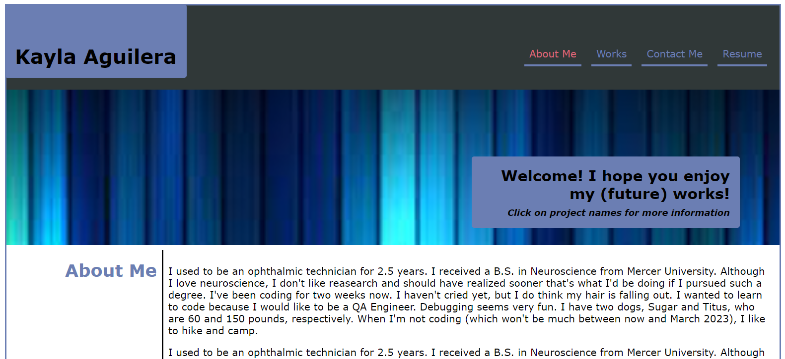
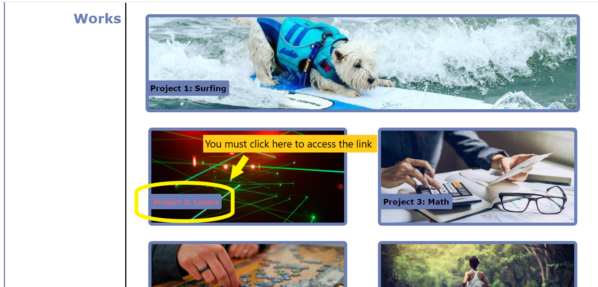

# <Portfolio>

## Description

This is a website to show case all of my future coding projects that will be completed throughout the bootcamp/my career. When the webpage is opened, my first and last name display to the left-hand side of the screen, and links to information about me, my works, how to contact me, and my resume, are located on the right-hand side.

## Installation

N/A

## Usage

When the user hovers over an element that provides a link, it will be highlighted in pink.

Clicking any of the links at the top will take you to the associated section of the webpage, save for the "Resume" link which is a URL.

To launch a new tab to view any of the projects under "Works", you must click on the project name rather than the picture, although hovering over the image does result in the pink element highlighting.

Currently, the URL links are placeholders to the Google homepage until respective profiles and projects are fully developed.

## Resources

How to add a background image to a section: <a href="https://www.w3schools.com/cssref/pr_background-image.php">W3 Schools - Background Image</a>

How to scroll to a section of the webpage: <a href="https://stackoverflow.com/questions/24739126/scroll-to-a-specific-element-using-html">Stack Overflow</a>